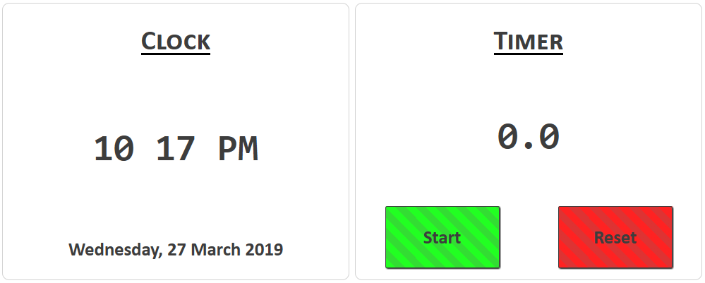

Challenge 03 - Clever Clock
=====================

Begin by opening the ```ictgradschool/web/cleverclock/clever_clock.html``` file and previewing it in your browser of choice.

For this challenge you will be required to create several different types of event handling code. Along with click handlers, you will be using a combination of the setTimeout()  and setInterval() methods. This will require you to research these methods and how structure your code appropriately to handle these events. There are lots of bugs that can happen if references to timers are not managed in the right way so test and debug your code regularly. There is a commented example of a timer within the JavaScript lab that you may use to help develop your understanding of how to structure timer events. 

Remember that you need to think carefully about how you structure all of your event handling code so that events happen when you expect them to and that you manage the scope of the variables in your code. 

By making changes **only** within the clever_clock.js file (No touching the HTML or CSS!) you will accomplish the following:

# Clock Task

+ In the left-hand 'Clock' pane, you will update the current time **every second**. 
  - You will display the time in 12-hour format, with the `hours` number ranging from 0-12 only
  - You will display `AM` or `PM` appropriately for if the time shown is in the morning or afternoon
  - The `hours` and `minutes` values should always be 2 digits long. If the `hours` or `minutes` values only have a single digit, you will pad it from the left with zeros
    - *HINT*: Look into the [`padStart()`](https://developer.mozilla.org/en-US/docs/Web/JavaScript/Reference/Global_Objects/String/padStart) function that string support 
  + Each second, you will show or hide the colon separating the `hours` and `minutes` values, generating a blinking effect
  + Ensure that the clock is updated as soon as the page loads. There should be no point where the default `00:00 AM` value should be seen
+ In the bottom of the left-hand 'Clock' pane, you will update the current date periodically
  - This date should be in a form like `Thursday, 28 March 2019`, with the weekday and month spelled out completely
    + *HINT*: You could do this long hand, or if you are feeling like a (possible) shortcut you could look into [`Date.toLocaleDateString()`](https://developer.mozilla.org/en-US/docs/Web/JavaScript/Reference/Global_Objects/Date/toLocaleDateString). The locale language tag for New Zealand is `en-NZ`.
  - Ensure that the date is updated as soon as the page loads. 

# Timer Task

For this task, look carefully at the screenshots below and the existing code in the project. 
  
+ In the right-hand 'Timer' panel, you will implement a simple stopwatch.
  - When the `Start` button is pressed it should change to display the text `Stop`
  - When the `Stop` button is pressed it should change to display the text `Start`
  - When the `Start` button is pressed, you should update the timer display **10 times per second** to reflect the amount of time elapsed
    + *HINT*: You will count up each time the timer goes off. Do not count up in `0.1` increments as your number will start to drift due to floating point error accumulation. Count up in whole number increments and divide the number down when it is time to display
  - When the `Stop` button is pressed, if the timer is displaying a number greater than `0.0`, start a **30 second countdown**. When this timer finishes, reset the timer display to `0.0`
    + If the timer is restarted before this timeout has finished, the timer should be cleared and the timer should continue counting from where it left off
  - When the `Reset` button is pressed, reset the timer display to `0.0` **IF**
    + The timer is not currently running, **and**
    + The timer display is anything other than `0.0`
  - If the `Reset` button is pressed while the automatic reset countdown is active, the timer should be cleared
  - Apply the CSS class `.button_enabled` or `.button_disabled` to the `Start`/`Stop`/`Reset` buttons depending on if the button will do anything if it is clicked at that moment.
    + Eg, the `Reset` button should have the `.button_disabled` class when the timer is running, as clicking it will do nothing, but should have the `.button_enabled` class if the timer is stopped and the display is not `0.0`

When complete, your page will look like the following when the timer is paused:



.. like the following when the timer is running:


.. and like the following when the timer has been stopped but not cleared:


Ensure you test your page as you work to ensure that it is functioning as intended at each stage. Remember to use the browser inspection console to look for errors while developing.

*HINTS*:
+ Remember to record the returned values from `setTimeout()` and `setInterval()` calls. You will need these values if you want to stop the timers
+ You can use the recorded timer values to determine if the timer is running or not. Set these into a variable when the timer starts, and set the value to `undefined` when the timer stops. If you look at this variable and it is not `undefined` then you know the timer is running.
